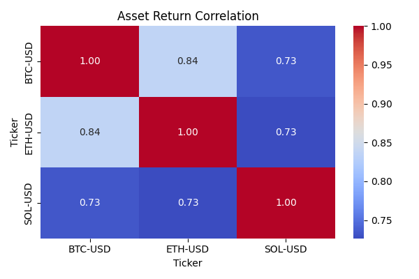

# 📈Multi-Crypto Quant Strategy: Momentum × Mean Reversion × Blending

This project implements a multi-strategy, volatility-adjusted portfolio across major cryptocurrencies like BTC, ETH, and SOL, combining:

📈 Momentum (via MA-20 crossover)

🔁 Mean Reversion (via Z-score reversal)

🧪 Factor Blending (user-defined mix of both)

📉 Volatility-aware rebalancing (inverse volatility)

Designed as a production-ready quant research pipeline, the code is fully modular and extendable — ideal for quant finance portfolios, fintech interviews, or remote roles in crypto trading.

## 📂Files and Folders

fetch_data.py: Script for fetching financial data.

main.ipynb: Jupyter Notebook likely containing the main workflow, including data processing, strategy execution, and analysis.

metrics.py: Module for calculating various performance metrics of the portfolio.

plot.py: Script for generating visualizations, such as cumulative returns and correlation heatmaps.

signals.py: Module for generating trading signals.

strategy.py: Script defining the investment strategy or strategies.

correlation_heatmap.png: Image displaying the correlation heatmap of assets.

cummulative_returns.png: Image showing the cumulative returns of the portfolio.

Summarized_metrics.png: A dataframe containing all the performance metrics of the assets(Sharpe ratio, Sortino ratio, CAGR, Max Drawdown, Calmar Ratio, Volatility)

## 📌Highlights

| Component                    | Description                                               |
| ---------------------------- | --------------------------------------------------------- |
| 🪙 **Assets**                | BTC-USD, ETH-USD, SOL-USD from Yahoo Finance (`yfinance`) |
| 📈 **Momentum Signal**       | Price > MA-20                                             |
| 🔁 **Mean Reversion Signal** | Z-score-based re-entry after extreme moves                |
| 🧪 **Blended Signal**        | Adjustable weight between momentum and mean reversion     |
| 🧮 **Weighting Scheme**      | Inverse volatility (daily std dev)                        |
| 🔁 **Rebalancing**           | Daily                                                     |
| 📊 **Metrics Tracked**       | Sharpe, Sortino, CAGR, Max Drawdown, Calmar, Volatility   |
| 📉 **Visualization**         | Strategy comparison and correlation heatmap               |

## 📊Sample Output

📊 Strategy Comparison Summary:
                Sharpe  Sortino    CAGR  Calmar  Max DD  Volatility
Strategy                                                           
Momentum        0.5046   0.6076  0.1367  0.2537 -0.5388      0.5015
Mean Reversion  0.5219   0.6441  0.1392  0.1893 -0.7350      0.6310
Blended         0.4605   0.6237  0.0907  0.1172 -0.7738      0.6549

## 📈Plots Generated

📊 Cumulative Return Comparison

🔥 Correlation Heatmap

## 🧠Factor Strategy Logic

1️⃣ Momentum

python:
signal = (price > price.rolling(20).mean()).astype(int)

2️⃣ Mean Reversion

python:
z = (price - mean) / std
signal = ((z < -1.0) | (z > 1.0)).astype(int)

3️⃣ Factor Blending

python:
blended_signal = alpha * momentum + (1 - alpha) * mean_reversion

You can control the alpha value in main.py to shift preference between the two strategies.

## 🧪How to Use

✅ 1. Clone the Repository

bash:
git clone https://github.com/yourusername/multi_crypto_momentum_project.git
cd multi_crypto_momentum_project

✅ 2. Install Dependencies

bash:
pip install -r requirements.txt

✅ 3. Run the Pipeline

bash:
Run the main.ipynb notebook

## 🧠Ideas for Further Improvement

🧮 Add monthly rebalancing option

🧰 Add more crypto assets or traditional assets (SPY, GLD)

⚙️ Add rolling beta and alpha metrics

📊 Export strategy metrics as CSV

🧠 Add ML model to predict next-day signal confidence (LSTM/Random Forest)

## 🧰Contributions

Contributions are welcome! If you have suggestions for improvements or new features, please feel free to:

Fork the repository.

Create a new branch (git checkout -b feature/AmazingFeature).

Commit your changes (git commit -m 'Add some AmazingFeature').

Push to the branch (git push origin feature/AmazingFeature).

Open a Pull Request.

## 👨‍💻About the Author

This is part of my long-term goal to break into quantitative trading, fintech research, and remote global roles in financial data science.
I’m documenting each project as I build a public, credible GitHub portfolio.

## License 

MIT LIcense

